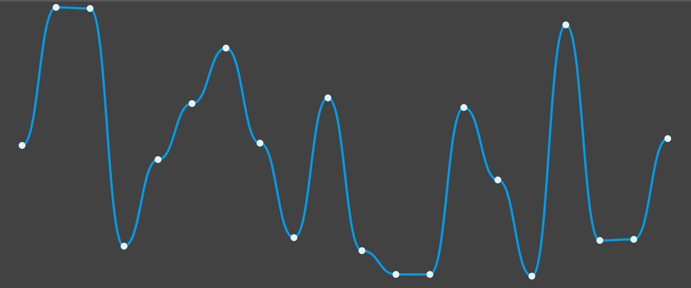

# Angular (2+) chart

It's an Angular module (ChartModule) for svg line charts construction.



##Getting Started

1. Import ChartModule to you main module

```
imports: [
	ChartModule
],
```

2. Init chart in your template (```point``` is required parameter)

```angular2html
<app-chart [points]="points"></app-chart>
```

##Parameters
### points* (default: [])

### step  (default: 10)
Distance between points x
### width (default: '100%')
Svg element width
### height (default: '100%')
Svg element height
### chartWidth (default: 2)
Chart line width
### chartColor (default: '#039BE5')
Chart line color
### showPoints (default: false)
Show points on chart
### pointsColor (default: '#E1F5FE')
Points color
### pointRadius (default: 2)
Radius of points
    	
    	
    	
   
